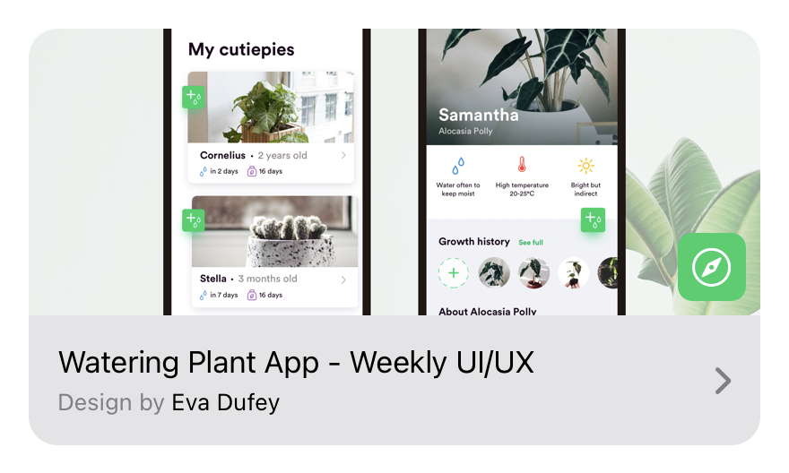
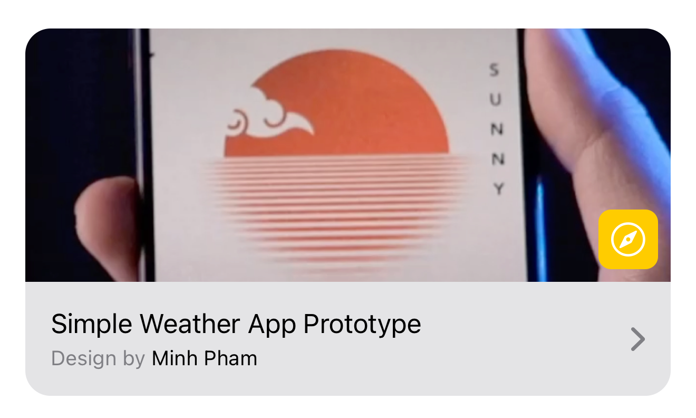
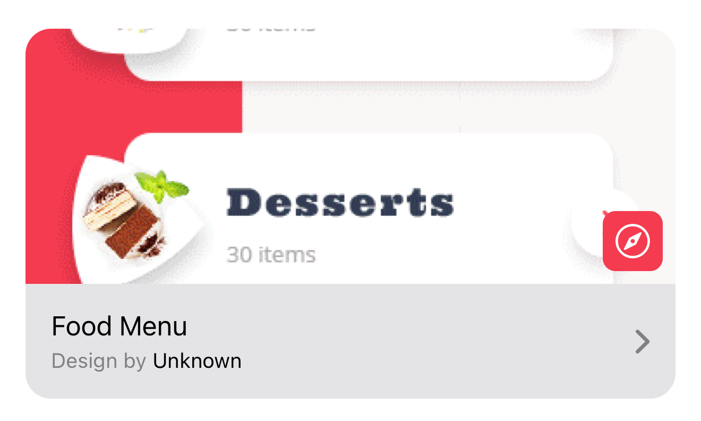

# PixelPerfect - SwiftUI

This is a collection of designs turned into SwiftUI prototypes. The idea behind this repository is to have a common place to experiment with designs implemented using SwiftUI.

# Applications

## Goodreads

- Design author: **Sylvie Stephanie**
- Link to design: [Goodreads](https://medium.muz.li/goodreads-app-ux-case-study-2e63214fc005)

## Watering Plant App

- Design author: **Eva Dufey**
- Link to design: [Watering Plant App - Weekly UI/UX](https://dribbble.com/shots/5939169-Watering-Plant-App-Weekly-UI-UX)

## Simple Weather App

- Design author: **Minh Pham**
- Link to design: [Simple Weather App Prototype](https://dribbble.com/shots/14153317-simple-weather-app-prototype)

## Food Menu App

- Design author: **Unknown**
- Link to design: [Food Menu App](https://www.pinterest.com/pin/774124922767471/)
